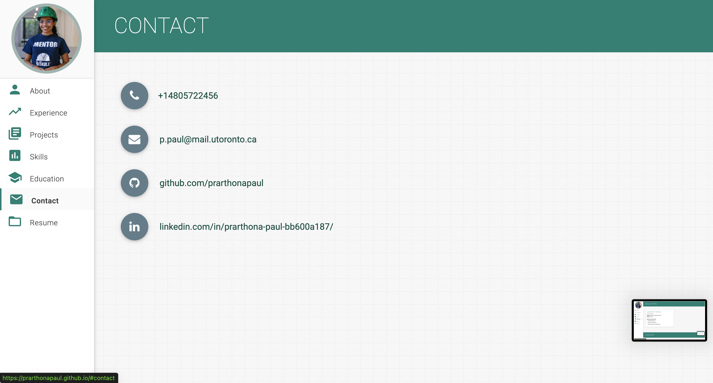

# Personal Portfolio ⚡️ 

This repo is a clone of
https://github.com/varadbhogayata/varadbhogayata.github.io 

> https://prarthonapaul.github.io

### Github Repo 

 
  <kbd>
    
  </kbd>

### Website Preview

 
  <kbd>
    
  </kbd>

### About Section 

 
  <kbd>
    
  </kbd>

### Experience Section 

 
  <kbd>
    
  </kbd>

### Tools Section 

 
  <kbd>
    
  </kbd>

### Education Section 

 
  <kbd>
    
  </kbd>

### Contact Section 

 
  <kbd>
    
  </kbd>

### Resume Section 

 
  <kbd>
    
  </kbd>

